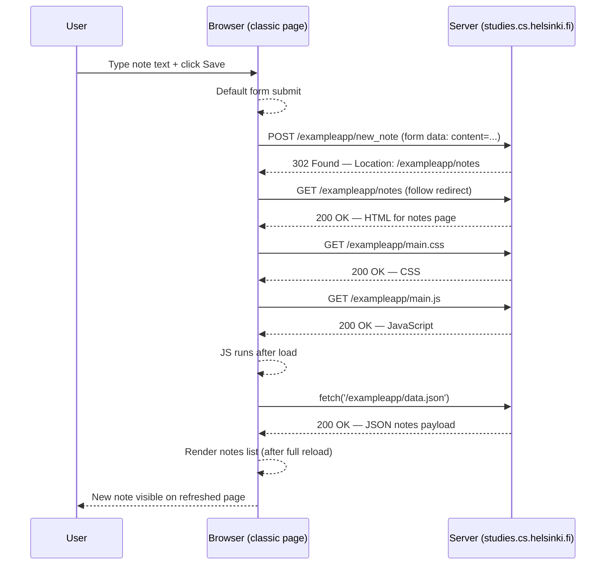

```mermaid
sequenceDiagram
    participant U as User
    participant B as Browser (classic page)
    participant S as Server (studies.cs.helsinki.fi)

    U->>B: Type note text + click Save
    B-->>B: Default form submit
    B->>S:  POST /exampleapp/new_note (form data: content=...)
    S-->>B: 302 Found — Location: /exampleapp/notes
    B->>S: GET /exampleapp/notes (follow redirect)
    S-->>B: 200 OK — HTML for notes page
    B->>S: GET /exampleapp/main.css
    S-->>B: 200 OK — CSS
    B->>S: GET /exampleapp/main.js
    S-->>B: 200 OK — JavaScript
    B-->>B: JS runs after load
    B->>S: fetch('/exampleapp/data.json')
    S-->>B: 200 OK — JSON notes payload
    B-->>B: Render notes list (after full reload)
    B-->>U: New note visible on refreshed page

```