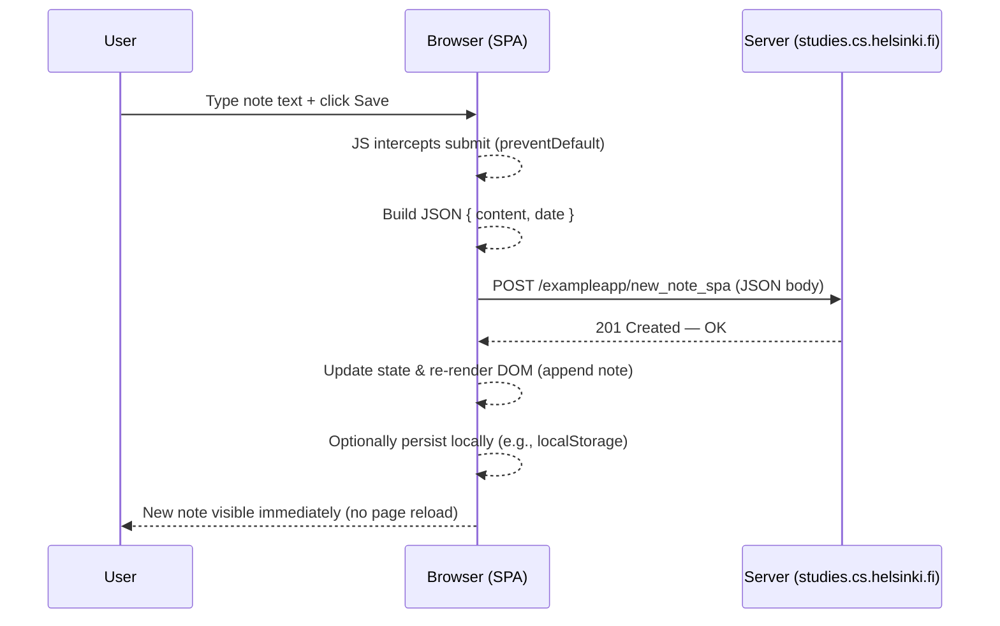

```mermaid
sequenceDiagram
    participant U as User
    participant B as Browser (SPA)
    participant S as Server (studies.cs.helsinki.fi)

    U->>B: Type note text + click Save
    B-->>B: JS intercepts submit (preventDefault)
    B-->>B: Build JSON { content, date }
    B->>S: POST /exampleapp/new_note_spa (JSON body)
    S-->>B: 201 Created — OK
    B-->>B: Update state & re-render DOM (append note)
    B-->>B: Optionally persist locally (e.g., localStorage)
    B-->>U: New note visible immediately (no page reload)

```