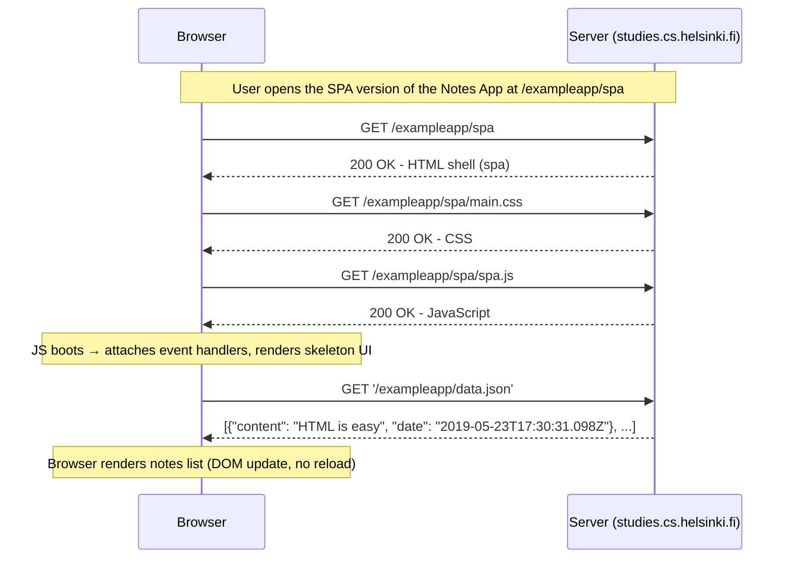

```mermaid
sequenceDiagram
    participant B as Browser
    participant S as Server (studies.cs.helsinki.fi)

    Note over B,S: User opens the SPA version of the Notes App at /exampleapp/spa

    B->>S: GET /exampleapp/spa
    S-->>B: 200 OK - HTML shell (spa)
    B->>S: GET /exampleapp/spa/main.css
    S-->>B: 200 OK - CSS
    B->>S: GET /exampleapp/spa/spa.js
    S-->>B: 200 OK - JavaScript
    Note over B: JS boots → attaches event handlers, renders skeleton UI
    B->>S: GET '/exampleapp/data.json'
    S-->>B: [{"content": "HTML is easy", "date": "2019-05-23T17:30:31.098Z"}, ...]
    Note over B: Browser renders notes list (DOM update, no reload)
```